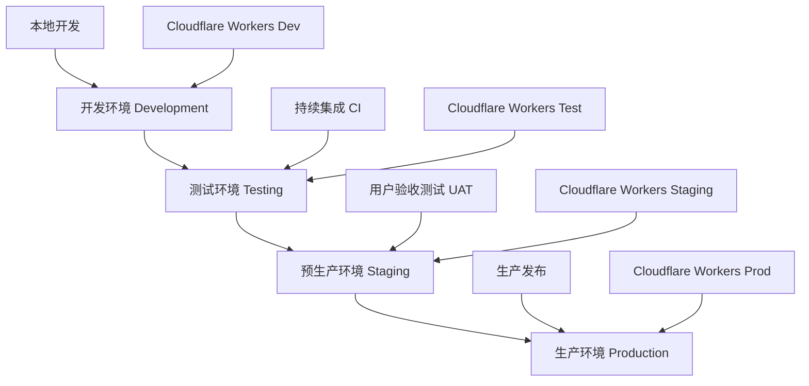

# 🚀 AWS MCP SSE + Cloudflare 部署和上线策略

## 📋 部署策略总览

### 部署目标
安全、稳定、高效地将AWS MCP服务器从STDIO架构迁移并部署到Cloudflare Workers全球边缘网络。

### 部署原则
- **零停机时间**: 通过蓝绿部署和灰度发布实现无中断迁移
- **可回滚性**: 任何阶段都能快速回滚到上一个稳定版本
- **渐进式发布**: 从小规模用户开始，逐步扩大覆盖范围
- **监控驱动**: 基于实时监控数据决策部署进度
- **安全优先**: 每个部署阶段都经过安全验证

## 🏗️ 部署环境架构

### 环境分层设计



### 环境配置对比

| 环境 | 域名 | 用途 | 限制 | 监控级别 |
|------|------|------|------|----------|
| **开发环境** | `dev.aws-mcp.workers.dev` | 功能开发、调试 | 单用户 | 基础 |
| **测试环境** | `test.aws-mcp.workers.dev` | 自动化测试、集成验证 | 内部团队 | 详细 |
| **预生产环境** | `staging.aws-mcp.workers.dev` | 用户验收、性能测试 | 限定用户 | 生产级 |
| **生产环境** | `aws-mcp.your-domain.com` | 正式服务 | 全部用户 | 完整 |

## 📅 部署时间表和阶段

### 阶段1: 开发环境部署 (D1-D2, 2天)
**目标**: 建立基础部署流程和自动化

#### D1: 基础设施准备
**任务清单**:
- [x] Cloudflare账户配置和权限设置
- [x] Workers项目创建和环境变量配置
- [x] 域名配置和SSL证书设置
- [x] 基础监控和日志配置
- [x] CI/CD流水线搭建

**验收标准**:
```bash
# 健康检查通过
curl https://dev.aws-mcp.workers.dev/health
# 返回: {"status":"healthy","partition":"aws"}

# 基础功能验证
curl -X POST https://dev.aws-mcp.workers.dev/mcp/message \
  -H "Content-Type: application/json" \
  -d '{"jsonrpc":"2.0","id":1,"method":"tools/list"}'
```

#### D2: 自动化部署流程
**任务清单**:
- [x] GitHub Actions工作流配置
- [x] 自动化测试集成
- [x] 部署脚本和回滚机制
- [x] 环境变量和密钥管理
- [x] 部署通知和监控

**交付物**:
- CI/CD配置文件
- 自动化部署脚本
- 监控仪表板
- 部署文档

### 阶段2: 测试环境部署 (D3-D5, 3天)
**目标**: 完整功能验证和性能基准测试

#### D3: 测试环境搭建
**任务清单**:
- [ ] 测试环境自动化部署
- [ ] 测试数据和场景准备
- [ ] 自动化测试套件执行
- [ ] 性能基准测试配置
- [ ] 安全扫描和漏洞检测

#### D4-D5: 全面测试验证
**测试范围**:
- [ ] 功能完整性测试 (100%覆盖)
- [ ] 性能压力测试 (1000并发)
- [ ] 安全漏洞扫描 (OWASP标准)
- [ ] 兼容性测试 (多客户端)
- [ ] 稳定性测试 (24小时运行)

**验收标准**:
```yaml
测试通过标准:
  功能测试: 100% pass rate
  性能测试: P95 < 200ms, QPS > 1000
  安全测试: 0 high severity vulnerabilities
  稳定性: 99.9% uptime over 24h
  错误率: < 0.1%
```

### 阶段3: 预生产环境部署 (D6-D8, 3天)
**目标**: 生产环境模拟和用户验收测试

#### D6: 预生产部署
**任务清单**:
- [ ] 生产级配置部署
- [ ] 用户访问控制设置
- [ ] 完整监控和告警配置
- [ ] 备份和恢复流程验证
- [ ] 运维手册和流程验证

#### D7-D8: 用户验收测试
**测试参与者**:
- 内部开发团队
- 产品经理和QA
- 外部Beta用户 (5-10人)
- AI工具集成伙伴

**测试内容**:
- [ ] 端到端业务流程验证
- [ ] 用户体验和易用性评估
- [ ] 集成兼容性验证
- [ ] 文档完整性检查
- [ ] 培训材料验证

### 阶段4: 生产环境部署 (D9-D12, 4天)
**目标**: 安全、稳定的生产发布

#### D9: 生产预备
**任务清单**:
- [ ] 生产环境最终配置
- [ ] 安全配置和权限审查
- [ ] 监控和告警系统就绪
- [ ] 应急响应团队待命
- [ ] 回滚方案测试确认

#### D10: 灰度发布 (5%用户)
**发布策略**:
```yaml
灰度发布配置:
  初始流量: 5%
  监控窗口: 4小时
  成功标准:
    - 错误率 < 0.1%
    - 延迟 P95 < 200ms
    - 可用性 > 99.9%
  回滚触发:
    - 错误率 > 1%
    - 延迟 P95 > 500ms
    - 可用性 < 99%
```

#### D11: 渐进式扩大 (50%用户)
**扩展策略**:
- 如果4小时监控正常，扩展到50%
- 继续监控6小时
- 用户反馈收集和分析
- 性能指标持续跟踪

#### D12: 全量发布 (100%用户)
**完全发布**:
- 扩展到100%用户流量
- 24小时密集监控
- 用户支持团队就绪
- 问题快速响应机制

## 🔄 部署流程和自动化

### CI/CD流水线设计

```yaml
# .github/workflows/deploy.yml
name: Deploy AWS MCP Server

on:
  push:
    branches: [main, develop]
  pull_request:
    branches: [main]

jobs:
  test:
    runs-on: ubuntu-latest
    steps:
      - uses: actions/checkout@v3
      - name: Setup Node.js
        uses: actions/setup-node@v3
        with:
          node-version: '18'
      
      - name: Install dependencies
        run: npm ci
      
      - name: Run tests
        run: |
          npm run test:unit
          npm run test:integration
          npm run test:security
      
      - name: Build project
        run: npm run build
      
      - name: Upload test results
        uses: actions/upload-artifact@v3
        with:
          name: test-results
          path: coverage/

  deploy-dev:
    needs: test
    if: github.ref == 'refs/heads/develop'
    runs-on: ubuntu-latest
    environment: development
    steps:
      - uses: actions/checkout@v3
      - name: Deploy to Development
        uses: cloudflare/wrangler-action@v3
        with:
          apiToken: ${{ secrets.CLOUDFLARE_API_TOKEN }}
          environment: development
          command: deploy --env development

  deploy-staging:
    needs: test
    if: github.ref == 'refs/heads/main'
    runs-on: ubuntu-latest
    environment: staging
    steps:
      - uses: actions/checkout@v3
      - name: Deploy to Staging
        uses: cloudflare/wrangler-action@v3
        with:
          apiToken: ${{ secrets.CLOUDFLARE_API_TOKEN }}
          environment: staging
          command: deploy --env staging
      
      - name: Run E2E tests
        run: npm run test:e2e
        env:
          E2E_BASE_URL: https://staging.aws-mcp.workers.dev

  deploy-production:
    needs: [deploy-staging]
    if: github.ref == 'refs/heads/main'
    runs-on: ubuntu-latest
    environment: production
    steps:
      - uses: actions/checkout@v3
      - name: Deploy to Production
        uses: cloudflare/wrangler-action@v3
        with:
          apiToken: ${{ secrets.CLOUDFLARE_API_TOKEN }}
          environment: production
          command: deploy --env production
      
      - name: Verify deployment
        run: |
          curl -f https://aws-mcp.your-domain.com/health
          npm run test:smoke
        env:
          SMOKE_TEST_URL: https://aws-mcp.your-domain.com
```

### 部署脚本自动化

```bash
#!/bin/bash
# deploy.sh - 自动化部署脚本

set -e

ENVIRONMENT=${1:-development}
CONFIRM=${2:-false}

echo "🚀 开始部署到 $ENVIRONMENT 环境..."

# 环境检查
if [ "$ENVIRONMENT" = "production" ] && [ "$CONFIRM" != "confirm" ]; then
    echo "❌ 生产环境部署需要确认: ./deploy.sh production confirm"
    exit 1
fi

# 依赖检查
echo "📦 检查依赖..."
npm ci
npm run build

# 测试运行
echo "🧪 运行测试..."
npm run test:unit
npm run test:integration

# 安全检查
echo "🔒 安全扫描..."
npm audit --audit-level high
npm run test:security

# 部署执行
echo "🌐 部署到 Cloudflare Workers..."
npx wrangler deploy --env $ENVIRONMENT

# 部署验证
echo "✅ 验证部署..."
BASE_URL=$(npx wrangler whoami | grep "account" | cut -d'"' -f4)
curl -f "https://aws-docs-mcp-server-$ENVIRONMENT.$BASE_URL.workers.dev/health"

# 烟雾测试
echo "💨 执行烟雾测试..."
npm run test:smoke

echo "🎉 部署完成!"
```

## 📊 监控和健康检查

### 部署监控指标

| 指标类别 | 关键指标 | 监控频率 | 告警阈值 |
|---------|----------|----------|----------|
| **可用性** | HTTP状态码2xx比例 | 1分钟 | < 99.9% |
| **性能** | 响应时间P95 | 1分钟 | > 200ms |
| **错误率** | 5xx错误率 | 1分钟 | > 0.1% |
| **吞吐量** | 请求/秒 | 1分钟 | 基线偏差>50% |
| **资源** | CPU使用率 | 30秒 | > 80% |

### 健康检查设计

```typescript
// 健康检查端点增强
app.get('/health', async (c) => {
  const health = {
    status: 'healthy',
    timestamp: new Date().toISOString(),
    version: '1.0.0',
    environment: c.env.ENVIRONMENT || 'development',
    partition: c.env.AWS_DOCUMENTATION_PARTITION || 'aws',
    checks: {
      database: 'healthy', // 如果有数据库
      external_apis: 'healthy',
      memory: 'healthy',
      disk: 'healthy'
    },
    metrics: {
      uptime: process.uptime(),
      requests_total: requestCounter,
      requests_errors: errorCounter,
      response_time_avg: avgResponseTime
    }
  };

  // 检查各个组件健康状态
  try {
    // AWS API连通性检查
    await fetch('https://docs.aws.amazon.com', { 
      method: 'HEAD',
      timeout: 5000 
    });
  } catch (error) {
    health.checks.external_apis = 'unhealthy';
    health.status = 'degraded';
  }

  const statusCode = health.status === 'healthy' ? 200 : 503;
  return c.json(health, statusCode);
});
```

### 告警配置

```yaml
# cloudflare-alerts.yml
alerts:
  - name: "High Error Rate"
    condition: "error_rate > 1%"
    duration: "5m"
    severity: "critical"
    channels: ["slack", "email", "pagerduty"]
  
  - name: "High Response Time"
    condition: "p95_response_time > 500ms"
    duration: "10m"
    severity: "warning"
    channels: ["slack", "email"]
  
  - name: "Low Availability"
    condition: "availability < 99%"
    duration: "5m"
    severity: "critical"
    channels: ["slack", "email", "pagerduty"]
```

## 🔙 回滚策略

### 自动回滚触发条件

```yaml
自动回滚触发:
  错误率: > 5% (持续5分钟)
  响应时间: P95 > 2000ms (持续10分钟)
  可用性: < 95% (持续3分钟)
  健康检查失败: > 50% (持续2分钟)
```

### 回滚执行流程

```bash
# 快速回滚脚本
#!/bin/bash
# rollback.sh

ENVIRONMENT=${1:-production}
REASON=${2:-"manual rollback"}

echo "⚠️ 开始回滚 $ENVIRONMENT 环境..."
echo "回滚原因: $REASON"

# 获取上一个部署版本
PREVIOUS_DEPLOYMENT=$(npx wrangler deployments list --env $ENVIRONMENT | head -2 | tail -1 | awk '{print $1}')

if [ -z "$PREVIOUS_DEPLOYMENT" ]; then
    echo "❌ 无法找到上一个部署版本"
    exit 1
fi

echo "🔄 回滚到版本: $PREVIOUS_DEPLOYMENT"

# 执行回滚
npx wrangler rollback $PREVIOUS_DEPLOYMENT --env $ENVIRONMENT

# 验证回滚
echo "✅ 验证回滚..."
sleep 30
curl -f "https://aws-docs-mcp-server-$ENVIRONMENT.workers.dev/health"

# 通知团队
echo "📢 通知团队回滚完成..."
# 发送通知到Slack/Teams等

echo "🎯 回滚完成!"
```

## 🛡️ 安全部署配置

### 生产环境安全清单

- [ ] **HTTPS强制**: 所有流量必须使用HTTPS
- [ ] **CORS配置**: 限制跨域访问来源
- [ ] **API密钥管理**: 使用Cloudflare Workers KV存储
- [ ] **速率限制**: 防止API滥用
- [ ] **输入验证**: 严格验证所有输入参数
- [ ] **日志安全**: 避免记录敏感信息
- [ ] **依赖扫描**: 定期扫描第三方依赖漏洞

### 环境变量和密钥管理

```bash
# 生产环境变量设置
npx wrangler secret put AWS_API_KEY --env production
npx wrangler secret put MONITORING_TOKEN --env production
npx wrangler secret put ALERT_WEBHOOK_URL --env production

# 公开配置变量
npx wrangler vars set AWS_DOCUMENTATION_PARTITION aws --env production
npx wrangler vars set FASTMCP_LOG_LEVEL ERROR --env production
npx wrangler vars set ENVIRONMENT production --env production
```

## 📈 性能优化部署

### 缓存策略配置

```typescript
// 生产环境缓存优化
app.use('/docs/*', async (c, next) => {
  // 设置缓存头
  c.header('Cache-Control', 'public, max-age=3600');
  c.header('CDN-Cache-Control', 'public, max-age=86400');
  await next();
});

// AWS文档内容缓存
const cacheKey = `docs:${btoa(url)}:${partition}`;
let cachedResult = await caches.default.match(cacheKey);

if (!cachedResult) {
  const result = await fetchDocumentation(url);
  const response = new Response(JSON.stringify(result), {
    headers: {
      'Content-Type': 'application/json',
      'Cache-Control': 'public, max-age=3600'
    }
  });
  await caches.default.put(cacheKey, response.clone());
  return response;
}
```

### 全球分发优化

```yaml
# wrangler.toml 生产配置
[env.production]
name = "aws-docs-mcp-server-prod"
route = "aws-mcp.your-domain.com/*"
usage_model = "bundled"

# 性能优化配置
compatibility_flags = ["nodejs_compat", "streams_enable_constructors"]
minify = true
```

## 📋 部署检查清单

### 预部署检查

- [ ] **代码审查**: 所有代码经过peer review
- [ ] **测试覆盖**: 单元测试覆盖率>90%
- [ ] **安全扫描**: 无高危漏洞
- [ ] **性能测试**: 达到性能基准
- [ ] **文档更新**: 部署文档最新
- [ ] **备份验证**: 回滚方案可执行
- [ ] **监控配置**: 告警规则已设置
- [ ] **团队通知**: 相关人员已知晓

### 部署后验证

- [ ] **健康检查**: 所有端点正常响应
- [ ] **功能测试**: 核心功能工作正常
- [ ] **性能监控**: 指标在正常范围内
- [ ] **错误日志**: 无异常错误
- [ ] **用户反馈**: 用户访问正常
- [ ] **监控告警**: 告警系统工作正常
- [ ] **文档同步**: 用户文档已更新
- [ ] **团队培训**: 运维团队已就绪

---

**🎯 部署策略制定完成！接下来设计性能基准测试和监控方案。**