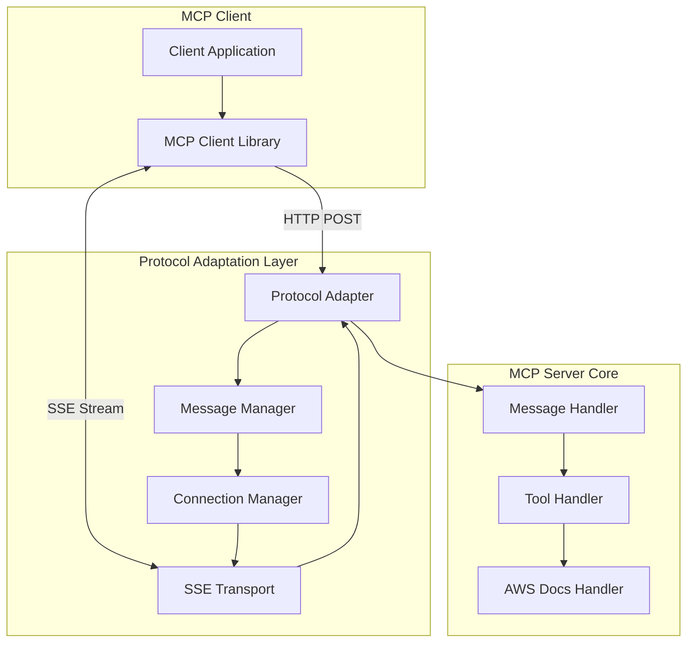
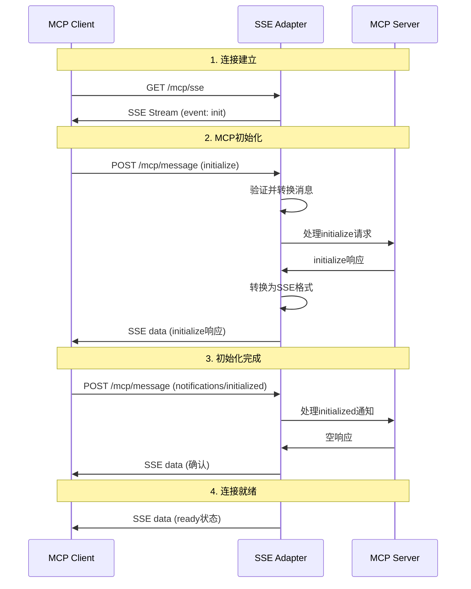

# 🔄 MCP协议适配架构设计

## 🎯 协议适配目标

### 适配器职责
MCP协议适配器的核心职责是在保持完整MCP协议兼容性的前提下，实现STDIO到SSE的无缝协议转换，确保现有MCP客户端无需任何修改即可使用SSE版本。

### 设计原则
- **协议透明性**: 客户端感知不到协议差异
- **完全兼容性**: 100%支持MCP 2024-11-05规范
- **性能优化**: 最小化协议转换开销
- **错误一致性**: 保持错误代码和消息格式一致
- **扩展性**: 支持未来MCP协议扩展

## 📋 MCP协议规范分析

### MCP协议核心消息类型

#### 1. 初始化序列
```typescript
// 客户端初始化请求
interface InitializeRequest {
  jsonrpc: '2.0';
  id: string | number;
  method: 'initialize';
  params: {
    protocolVersion: string;        // "2024-11-05"
    capabilities: ClientCapabilities;
    clientInfo: {
      name: string;
      version: string;
    };
  };
}

// 服务器初始化响应
interface InitializeResponse {
  jsonrpc: '2.0';
  id: string | number;
  result: {
    protocolVersion: string;
    capabilities: ServerCapabilities;
    serverInfo: {
      name: string;
      version: string;
      description?: string;
    };
  };
}

// 初始化完成通知
interface InitializedNotification {
  jsonrpc: '2.0';
  method: 'notifications/initialized';
  params?: {};
}
```

#### 2. 工具相关消息
```typescript
// 工具列表请求
interface ToolsListRequest {
  jsonrpc: '2.0';
  id: string | number;
  method: 'tools/list';
  params?: {};
}

// 工具列表响应
interface ToolsListResponse {
  jsonrpc: '2.0';
  id: string | number;
  result: {
    tools: Tool[];
  };
}

// 工具调用请求
interface ToolsCallRequest {
  jsonrpc: '2.0';
  id: string | number;
  method: 'tools/call';
  params: {
    name: string;
    arguments: Record<string, any>;
  };
}

// 工具调用响应
interface ToolsCallResponse {
  jsonrpc: '2.0';
  id: string | number;
  result: {
    content: Array<{
      type: 'text' | 'image' | 'resource';
      text?: string;
      data?: string;
      mimeType?: string;
    }>;
    isError?: boolean;
  };
}
```

#### 3. 错误处理消息
```typescript
interface MCPErrorResponse {
  jsonrpc: '2.0';
  id: string | number | null;
  error: {
    code: number;
    message: string;
    data?: any;
  };
}

// MCP标准错误代码
enum MCPErrorCodes {
  PARSE_ERROR = -32700,
  INVALID_REQUEST = -32600,
  METHOD_NOT_FOUND = -32601,
  INVALID_PARAMS = -32602,
  INTERNAL_ERROR = -32603,
  // 自定义错误代码范围: -32000 到 -32099
}
```

## 🔧 协议适配器架构设计

### 整体适配架构


### 核心适配器组件

#### 1. 协议适配器主类
```typescript
class MCPProtocolAdapter {
  private connections: Map<string, ConnectionContext>;
  private messageHandlers: Map<string, MessageHandler>;
  private eventEmitter: EventEmitter;
  private config: AdapterConfig;
  
  constructor(config: AdapterConfig) {
    this.config = {
      pingInterval: 30000,
      pongTimeout: 10000,
      maxConnections: 10000,
      messageTimeout: 30000,
      ...config
    };
    this.connections = new Map();
    this.messageHandlers = new Map();
    this.eventEmitter = new EventEmitter();
    this.setupDefaultHandlers();
  }
  
  // 连接生命周期管理
  async createConnection(request: Request): Promise<Response>;
  async handleMessage(message: MCPMessage, connectionId: string): Promise<MCPMessage>;
  async closeConnection(connectionId: string): Promise<void>;
  
  // 消息处理注册
  registerHandler(method: string, handler: MessageHandler): void;
  unregisterHandler(method: string): void;
  
  // SSE消息格式化
  formatSSEMessage(data: any, eventType?: string): string;
  parseSSEMessage(rawMessage: string): SSEMessage;
  
  // 协议转换
  private adaptRequestToSSE(mcpMessage: MCPMessage): SSEMessage;
  private adaptResponseToMCP(sseMessage: SSEMessage): MCPMessage;
}
```

#### 2. 连接上下文管理
```typescript
interface ConnectionContext {
  id: string;
  partition: 'aws' | 'aws-cn';
  state: ConnectionState;
  lastActivity: number;
  clientInfo?: ClientInfo;
  capabilities?: ClientCapabilities;
  metadata: ConnectionMetadata;
}

enum ConnectionState {
  CONNECTING = 'connecting',
  INITIALIZING = 'initializing', 
  READY = 'ready',
  CLOSING = 'closing',
  CLOSED = 'closed',
  ERROR = 'error'
}

interface ConnectionMetadata {
  userAgent?: string;
  ipAddress?: string;
  country?: string;
  dataCenter?: string;
  connectTime: number;
  messageCount: number;
  lastPing: number;
  errors: ConnectionError[];
}

class ConnectionManager {
  private connections: Map<string, ConnectionContext>;
  private cleanupTimer: number;
  
  constructor() {
    this.connections = new Map();
    this.startCleanupTimer();
  }
  
  createConnection(id: string, partition: 'aws' | 'aws-cn', metadata: Partial<ConnectionMetadata>): ConnectionContext;
  getConnection(id: string): ConnectionContext | undefined;
  updateConnection(id: string, updates: Partial<ConnectionContext>): void;
  removeConnection(id: string): boolean;
  
  // 连接状态管理
  setConnectionState(id: string, state: ConnectionState): void;
  markActivity(id: string): void;
  isConnectionAlive(id: string): boolean;
  
  // 连接清理
  cleanupStaleConnections(): number;
  getActiveConnections(): ConnectionContext[];
  getConnectionStats(): ConnectionStats;
}
```

#### 3. 消息路由和处理
```typescript
interface MessageHandler {
  (message: MCPMessage, context: ConnectionContext): Promise<MCPMessage>;
}

interface MessageRouter {
  route: Map<string, MessageHandler>;
  middleware: MiddlewareFunction[];
}

class MessageProcessor {
  private router: MessageRouter;
  private validator: MessageValidator;
  private serializer: MessageSerializer;
  
  constructor() {
    this.router = { route: new Map(), middleware: [] };
    this.validator = new MessageValidator();
    this.serializer = new MessageSerializer();
    this.setupDefaultRoutes();
  }
  
  async processMessage(
    message: MCPMessage, 
    context: ConnectionContext
  ): Promise<MCPMessage> {
    try {
      // 1. 消息验证
      const validationResult = await this.validator.validate(message);
      if (!validationResult.valid) {
        return this.createErrorResponse(
          message.id,
          MCPErrorCodes.INVALID_REQUEST,
          validationResult.error
        );
      }
      
      // 2. 中间件处理
      for (const middleware of this.router.middleware) {
        const result = await middleware(message, context);
        if (result) return result; // 中间件可以提前返回响应
      }
      
      // 3. 路由到处理器
      const handler = this.router.route.get(message.method);
      if (!handler) {
        return this.createErrorResponse(
          message.id,
          MCPErrorCodes.METHOD_NOT_FOUND,
          `Method '${message.method}' not found`
        );
      }
      
      // 4. 执行处理器
      const response = await handler(message, context);
      
      // 5. 响应验证
      this.validator.validateResponse(response);
      
      return response;
      
    } catch (error) {
      console.error('Message processing error:', error);
      return this.createErrorResponse(
        message.id,
        MCPErrorCodes.INTERNAL_ERROR,
        'Internal server error'
      );
    }
  }
  
  private setupDefaultRoutes(): void {
    this.router.route.set('initialize', this.handleInitialize.bind(this));
    this.router.route.set('notifications/initialized', this.handleInitialized.bind(this));
    this.router.route.set('tools/list', this.handleToolsList.bind(this));
    this.router.route.set('tools/call', this.handleToolsCall.bind(this));
    this.router.route.set('ping', this.handlePing.bind(this));
  }
}
```

### SSE传输层设计

#### 1. SSE消息格式规范
```typescript
interface SSEMessage {
  type: SSEMessageType;
  id: string;
  timestamp: number;
  data: any;
  metadata?: SSEMessageMetadata;
}

enum SSEMessageType {
  INIT = 'init',           // 连接初始化
  REQUEST = 'request',     // 客户端请求
  RESPONSE = 'response',   // 服务器响应
  ERROR = 'error',         // 错误消息
  PING = 'ping',           // 服务器心跳
  PONG = 'pong',           // 客户端心跳响应
  CLOSE = 'close'          // 连接关闭
}

interface SSEMessageMetadata {
  connectionId: string;
  partition: 'aws' | 'aws-cn';
  messageId: string;
  correlationId?: string;
  priority?: 'low' | 'normal' | 'high';
}

// SSE事件流格式化
class SSEFormatter {
  static formatMessage(message: SSEMessage): string {
    const lines: string[] = [];
    
    // 添加事件类型 (可选)
    if (message.type) {
      lines.push(`event: ${message.type}`);
    }
    
    // 添加消息ID (可选)
    if (message.id) {
      lines.push(`id: ${message.id}`);
    }
    
    // 添加数据 (必需)
    const dataStr = JSON.stringify({
      type: message.type,
      timestamp: message.timestamp,
      data: message.data,
      metadata: message.metadata
    });
    
    // 处理多行数据
    dataStr.split('\n').forEach(line => {
      lines.push(`data: ${line}`);
    });
    
    // 添加空行结束
    lines.push('');
    
    return lines.join('\n');
  }
  
  static parseMessage(eventData: string): SSEMessage {
    try {
      const parsed = JSON.parse(eventData);
      return {
        type: parsed.type,
        id: parsed.id || generateId(),
        timestamp: parsed.timestamp || Date.now(),
        data: parsed.data,
        metadata: parsed.metadata
      };
    } catch (error) {
      throw new Error(`Invalid SSE message format: ${error.message}`);
    }
  }
}
```

#### 2. 连接流管理
```typescript
class SSEStreamManager {
  private streams: Map<string, SSEStream>;
  
  createStream(connectionId: string, controller: ReadableStreamController): SSEStream {
    const stream = new SSEStream(connectionId, controller);
    this.streams.set(connectionId, stream);
    return stream;
  }
  
  getStream(connectionId: string): SSEStream | undefined {
    return this.streams.get(connectionId);
  }
  
  removeStream(connectionId: string): boolean {
    const stream = this.streams.get(connectionId);
    if (stream) {
      stream.close();
      this.streams.delete(connectionId);
      return true;
    }
    return false;
  }
  
  broadcast(message: SSEMessage, filter?: (stream: SSEStream) => boolean): void {
    for (const stream of this.streams.values()) {
      if (!filter || filter(stream)) {
        stream.send(message);
      }
    }
  }
}

class SSEStream {
  private controller: ReadableStreamController;
  private connectionId: string;
  private closed: boolean = false;
  
  constructor(connectionId: string, controller: ReadableStreamController) {
    this.connectionId = connectionId;
    this.controller = controller;
  }
  
  send(message: SSEMessage): void {
    if (this.closed) {
      throw new Error('Cannot send message to closed stream');
    }
    
    try {
      const formatted = SSEFormatter.formatMessage(message);
      const encoder = new TextEncoder();
      this.controller.enqueue(encoder.encode(formatted));
    } catch (error) {
      console.error(`Failed to send SSE message: ${error.message}`);
      this.close();
    }
  }
  
  close(): void {
    if (!this.closed) {
      this.closed = true;
      try {
        this.controller.close();
      } catch (error) {
        // 忽略关闭错误
      }
    }
  }
  
  isClosed(): boolean {
    return this.closed;
  }
}
```

## 🔄 协议转换流程

### 初始化序列转换


### 工具调用转换流程
```typescript
class ToolCallAdapter {
  async adaptToolCall(
    request: ToolsCallRequest,
    context: ConnectionContext
  ): Promise<ToolsCallResponse> {
    
    // 1. 请求验证和预处理
    const validatedParams = await this.validateToolCallParams(request.params);
    
    // 2. 工具路由
    const toolHandler = this.getToolHandler(request.params.name);
    if (!toolHandler) {
      throw new Error(`Tool '${request.params.name}' not found`);
    }
    
    // 3. 执行工具调用
    const startTime = Date.now();
    try {
      const result = await toolHandler.execute(validatedParams, context);
      
      // 4. 结果后处理
      const processedResult = await this.postProcessResult(result, context);
      
      // 5. 构造MCP响应
      return {
        jsonrpc: '2.0',
        id: request.id,
        result: {
          content: processedResult.content,
          isError: processedResult.isError || false
        }
      };
      
    } catch (error) {
      // 错误处理和转换
      const errorResponse = this.convertErrorToMCPFormat(error, request.id);
      return errorResponse;
      
    } finally {
      // 记录执行时间
      const duration = Date.now() - startTime;
      this.recordMetrics('tool_call_duration', duration, {
        tool: request.params.name,
        partition: context.partition
      });
    }
  }
  
  private async validateToolCallParams(params: any): Promise<any> {
    const toolName = params.name;
    const schema = this.getToolSchema(toolName);
    
    if (!schema) {
      throw new ValidationError(`Schema not found for tool: ${toolName}`);
    }
    
    const validation = await this.jsonValidator.validate(params.arguments, schema);
    if (!validation.valid) {
      throw new ValidationError(`Invalid parameters: ${validation.errors.join(', ')}`);
    }
    
    return params;
  }
}
```

### 错误处理和降级
```typescript
class ErrorHandler {
  private static readonly ERROR_MAPPINGS = new Map([
    ['TIMEOUT', { code: -32001, message: 'Request timeout', retry: true }],
    ['RATE_LIMIT', { code: -32002, message: 'Rate limit exceeded', retry: false }],
    ['AWS_API_ERROR', { code: -32003, message: 'AWS API error', retry: true }],
    ['VALIDATION_ERROR', { code: -32602, message: 'Invalid params', retry: false }],
    ['CONNECTION_ERROR', { code: -32004, message: 'Connection error', retry: true }]
  ]);
  
  static handleError(error: Error, messageId: any): MCPMessage {
    const errorType = this.classifyError(error);
    const errorInfo = this.ERROR_MAPPINGS.get(errorType) || {
      code: MCPErrorCodes.INTERNAL_ERROR,
      message: 'Internal server error',
      retry: false
    };
    
    return {
      jsonrpc: '2.0',
      id: messageId,
      error: {
        code: errorInfo.code,
        message: errorInfo.message,
        data: {
          type: errorType,
          retry: errorInfo.retry,
          timestamp: new Date().toISOString(),
          details: error.message
        }
      }
    };
  }
  
  private static classifyError(error: Error): string {
    if (error.name === 'TimeoutError') return 'TIMEOUT';
    if (error.message.includes('rate limit')) return 'RATE_LIMIT';
    if (error.message.includes('AWS')) return 'AWS_API_ERROR';
    if (error.name === 'ValidationError') return 'VALIDATION_ERROR';
    if (error.message.includes('connection')) return 'CONNECTION_ERROR';
    return 'UNKNOWN';
  }
}
```

## 🛡️ 协议安全和验证

### 消息验证器
```typescript
interface ValidationRule {
  field: string;
  type: 'string' | 'number' | 'boolean' | 'object' | 'array';
  required?: boolean;
  validator?: (value: any) => boolean | string;
}

class MessageValidator {
  private schemas: Map<string, ValidationRule[]>;
  
  constructor() {
    this.schemas = new Map();
    this.setupMCPSchemas();
  }
  
  async validate(message: MCPMessage): Promise<ValidationResult> {
    const errors: string[] = [];
    
    // 基础字段验证
    if (message.jsonrpc !== '2.0') {
      errors.push('Invalid jsonrpc version');
    }
    
    if (!message.method && !message.result && !message.error) {
      errors.push('Message must have method, result, or error');
    }
    
    // 方法特定验证
    if (message.method) {
      const schema = this.schemas.get(message.method);
      if (schema) {
        const paramErrors = await this.validateParams(message.params, schema);
        errors.push(...paramErrors);
      }
    }
    
    return {
      valid: errors.length === 0,
      errors
    };
  }
  
  private setupMCPSchemas(): void {
    // initialize方法schema
    this.schemas.set('initialize', [
      { field: 'protocolVersion', type: 'string', required: true },
      { field: 'capabilities', type: 'object', required: true },
      { field: 'clientInfo', type: 'object', required: true }
    ]);
    
    // tools/call方法schema
    this.schemas.set('tools/call', [
      { field: 'name', type: 'string', required: true },
      { field: 'arguments', type: 'object', required: true }
    ]);
  }
  
  private async validateParams(params: any, schema: ValidationRule[]): Promise<string[]> {
    const errors: string[] = [];
    
    for (const rule of schema) {
      const value = params?.[rule.field];
      
      if (rule.required && (value === undefined || value === null)) {
        errors.push(`Required field '${rule.field}' is missing`);
        continue;
      }
      
      if (value !== undefined) {
        if (typeof value !== rule.type) {
          errors.push(`Field '${rule.field}' must be of type ${rule.type}`);
        }
        
        if (rule.validator) {
          const result = rule.validator(value);
          if (typeof result === 'string') {
            errors.push(result);
          } else if (!result) {
            errors.push(`Field '${rule.field}' failed validation`);
          }
        }
      }
    }
    
    return errors;
  }
}
```

### 协议安全措施
```typescript
class ProtocolSecurityManager {
  private rateLimiter: RateLimiter;
  private messageQueue: MessageQueue;
  private securityPolicy: SecurityPolicy;
  
  constructor(policy: SecurityPolicy) {
    this.securityPolicy = policy;
    this.rateLimiter = new RateLimiter(policy.rateLimit);
    this.messageQueue = new MessageQueue(policy.messageQueue);
  }
  
  async checkSecurity(
    message: MCPMessage,
    context: ConnectionContext
  ): Promise<SecurityCheckResult> {
    
    // 1. 速率限制检查
    const rateLimitResult = await this.rateLimiter.checkLimit(
      context.metadata.ipAddress,
      message.method
    );
    
    if (!rateLimitResult.allowed) {
      return {
        allowed: false,
        reason: 'Rate limit exceeded',
        action: 'reject'
      };
    }
    
    // 2. 消息队列检查
    const queueStatus = await this.messageQueue.checkCapacity(context.id);
    if (!queueStatus.canAccept) {
      return {
        allowed: false,
        reason: 'Message queue full',
        action: 'throttle'
      };
    }
    
    // 3. 内容安全检查
    const contentCheck = await this.checkMessageContent(message);
    if (!contentCheck.safe) {
      return {
        allowed: false,
        reason: 'Unsafe content detected',
        action: 'sanitize'
      };
    }
    
    return { allowed: true };
  }
  
  private async checkMessageContent(message: MCPMessage): Promise<ContentCheckResult> {
    // 检查消息大小
    const messageSize = JSON.stringify(message).length;
    if (messageSize > this.securityPolicy.maxMessageSize) {
      return { safe: false, reason: 'Message too large' };
    }
    
    // 检查危险字符
    const messageStr = JSON.stringify(message);
    const dangerousPatterns = [
      /<script/i,
      /javascript:/i,
      /data:text\/html/i,
      /eval\(/i
    ];
    
    for (const pattern of dangerousPatterns) {
      if (pattern.test(messageStr)) {
        return { safe: false, reason: 'Dangerous content detected' };
      }
    }
    
    return { safe: true };
  }
}
```

## 📈 性能优化

### 消息批处理
```typescript
class MessageBatcher {
  private batchSize: number;
  private batchTimeout: number;
  private pendingMessages: Map<string, BatchedMessage[]>;
  private batchTimers: Map<string, number>;
  
  constructor(batchSize: number = 10, batchTimeout: number = 100) {
    this.batchSize = batchSize;
    this.batchTimeout = batchTimeout;
    this.pendingMessages = new Map();
    this.batchTimers = new Map();
  }
  
  addMessage(connectionId: string, message: MCPMessage): void {
    const pending = this.pendingMessages.get(connectionId) || [];
    pending.push({
      message,
      timestamp: Date.now()
    });
    
    this.pendingMessages.set(connectionId, pending);
    
    // 检查是否需要立即发送
    if (pending.length >= this.batchSize) {
      this.flushBatch(connectionId);
    } else if (!this.batchTimers.has(connectionId)) {
      // 设置超时定时器
      const timer = setTimeout(() => {
        this.flushBatch(connectionId);
      }, this.batchTimeout);
      
      this.batchTimers.set(connectionId, timer);
    }
  }
  
  private flushBatch(connectionId: string): void {
    const pending = this.pendingMessages.get(connectionId);
    if (!pending || pending.length === 0) return;
    
    // 清理状态
    this.pendingMessages.delete(connectionId);
    const timer = this.batchTimers.get(connectionId);
    if (timer) {
      clearTimeout(timer);
      this.batchTimers.delete(connectionId);
    }
    
    // 发送批处理消息
    this.sendBatch(connectionId, pending);
  }
  
  private sendBatch(connectionId: string, messages: BatchedMessage[]): void {
    const stream = this.streamManager.getStream(connectionId);
    if (!stream) return;
    
    for (const { message } of messages) {
      const sseMessage: SSEMessage = {
        type: SSEMessageType.RESPONSE,
        id: generateId(),
        timestamp: Date.now(),
        data: message
      };
      
      stream.send(sseMessage);
    }
  }
}
```

### 连接池优化
```typescript
class ConnectionPool {
  private pool: Connection[];
  private maxSize: number;
  private minSize: number;
  private activeConnections: Set<Connection>;
  private connectionFactory: ConnectionFactory;
  
  constructor(config: ConnectionPoolConfig) {
    this.maxSize = config.maxSize;
    this.minSize = config.minSize;
    this.pool = [];
    this.activeConnections = new Set();
    this.connectionFactory = new ConnectionFactory(config.connectionConfig);
    
    // 预创建最小数量的连接
    this.preWarm();
  }
  
  async acquire(): Promise<Connection> {
    // 从池中获取可用连接
    let connection = this.pool.pop();
    
    if (!connection) {
      // 池为空，创建新连接
      if (this.activeConnections.size < this.maxSize) {
        connection = await this.connectionFactory.create();
      } else {
        throw new Error('Connection pool exhausted');
      }
    }
    
    // 验证连接有效性
    if (!await connection.isValid()) {
      connection.close();
      return this.acquire(); // 递归获取
    }
    
    this.activeConnections.add(connection);
    return connection;
  }
  
  release(connection: Connection): void {
    this.activeConnections.delete(connection);
    
    if (connection.isValid() && this.pool.length < this.maxSize) {
      // 连接有效且池未满，归还到池中
      this.pool.push(connection);
    } else {
      // 关闭连接
      connection.close();
    }
  }
  
  private async preWarm(): Promise<void> {
    const promises = [];
    for (let i = 0; i < this.minSize; i++) {
      promises.push(this.connectionFactory.create());
    }
    
    const connections = await Promise.all(promises);
    this.pool.push(...connections);
  }
  
  getStats(): PoolStats {
    return {
      totalConnections: this.activeConnections.size + this.pool.length,
      activeConnections: this.activeConnections.size,
      idleConnections: this.pool.length,
      maxSize: this.maxSize,
      minSize: this.minSize
    };
  }
}
```

---

**🔄 MCP协议适配架构设计完成时间**: D9 (1天)
**审批负责人**: 协议架构师 + 开发团队Lead
**下一步**: 开发环境搭建指南制定