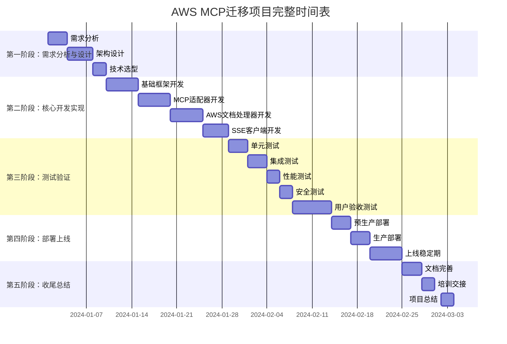
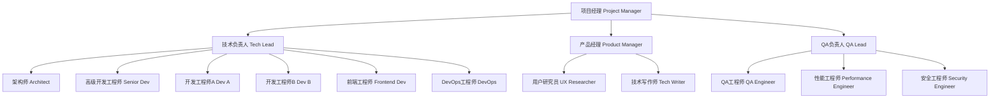
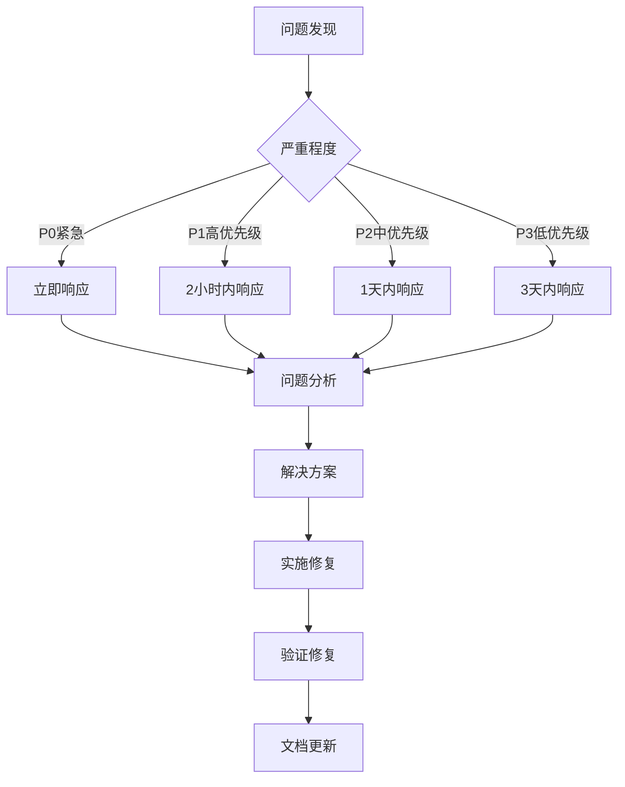

# 📅 项目工期和资源分配计划

## 🎯 项目总体规划

### 项目范围和目标
**项目名称**: AWS MCP STDIO → SSE + Cloudflare 迁移项目
**项目期间**: 45个工作日 (约9周)
**项目目标**: 将AWS官方Documentation MCP Server从STDIO协议迁移到SSE+Cloudflare架构

### 关键成功因素
- **时间目标**: 在45天内完成全部开发、测试、部署
- **质量目标**: 100%功能兼容，性能提升50%+
- **成本目标**: 控制在预算$60,000以内
- **风险目标**: 零重大故障，平滑迁移

## 📊 详细工期分解

### 项目阶段总览



### 阶段一：需求分析与设计 (9天)

#### Week 1: 需求分析与架构设计
**时间**: D1-D9 | **团队规模**: 4人

| 日期 | 工作内容 | 负责人 | 交付物 | 工时 |
|------|----------|-------|-------|------|
| **D1-D3** | 深度需求分析 | 产品经理+架构师 | 需求分析报告 | 32人时 |
| **D4-D7** | 系统架构设计 | 架构师+技术Lead | 架构设计文档 | 32人时 |
| **D8-D9** | 技术选型和原型 | 技术Lead+开发工程师 | 技术选型报告 | 16人时 |

**关键交付物**:
- ✅ 详细需求规格说明书
- ✅ 系统架构设计文档  
- ✅ 技术栈选型报告
- ✅ 项目风险评估报告
- ✅ 开发环境搭建指南

**质量关口**:
- [ ] 架构评审通过
- [ ] 技术选型评审通过
- [ ] 风险评估完成
- [ ] 开发环境验证通过

### 阶段二：核心开发实现 (19天)

#### Week 2-3: 基础框架和适配器开发
**时间**: D10-D19 | **团队规模**: 5人

| 模块 | 开发内容 | 负责人 | 工期 | 工时估算 |
|------|----------|-------|------|----------|
| **基础框架** | Cloudflare Workers项目搭建 | DevOps工程师 | 3天 | 24人时 |
| **MCP适配器** | STDIO到SSE协议转换 | 高级开发工程师 | 5天 | 40人时 |
| **类型定义** | TypeScript类型和接口 | 开发工程师 | 2天 | 16人时 |

#### Week 3-4: AWS文档处理器开发  
**时间**: D20-D29 | **团队规模**: 4人

| 功能模块 | 开发内容 | 负责人 | 工期 | 工时估算 |
|---------|----------|-------|------|----------|
| **文档读取** | HTML到Markdown转换 | 开发工程师A | 3天 | 24人时 |
| **文档搜索** | 搜索API集成和优化 | 开发工程师B | 3天 | 24人时 |
| **内容推荐** | 推荐算法实现 | 开发工程师A | 2天 | 16人时 |
| **错误处理** | 异常处理和降级 | 开发工程师B | 2天 | 16人时 |

#### Week 4-5: SSE客户端和集成
**时间**: D30-D33 | **团队规模**: 3人

| 组件 | 开发内容 | 负责人 | 工期 | 工时估算 |
|------|----------|-------|------|----------|
| **SSE客户端** | TypeScript客户端库 | 前端工程师 | 3天 | 24人时 |
| **示例应用** | 使用示例和Demo | 前端工程师 | 2天 | 16人时 |
| **文档生成** | API文档和使用指南 | 技术写作师 | 2天 | 16人时 |

**阶段交付物**:
- ✅ 完整的SSE版本MCP服务器
- ✅ TypeScript客户端SDK
- ✅ 单元测试覆盖率>90%
- ✅ 基础集成测试通过
- ✅ API文档和示例代码

### 阶段三：测试验证 (16天)

#### Week 5-6: 功能和性能测试
**时间**: D34-D43 | **团队规模**: 4人

| 测试类型 | 测试内容 | 负责人 | 工期 | 成功标准 |
|---------|----------|-------|------|----------|
| **单元测试** | 代码覆盖率和质量 | QA工程师 | 3天 | 覆盖率>90% |
| **集成测试** | 端到端功能验证 | QA工程师 | 3天 | 所有用例通过 |
| **性能测试** | 负载和压力测试 | 性能工程师 | 2天 | 性能基准达标 |
| **安全测试** | 漏洞扫描和审计 | 安全工程师 | 2天 | 无高危漏洞 |

#### Week 6-7: 用户验收测试
**时间**: D44-D49 | **团队规模**: 全员 + 外部用户

| 测试阶段 | 参与人员 | 测试重点 | 工期 | 成功标准 |
|---------|----------|----------|------|----------|
| **内部验收** | 核心团队 | 功能完整性验证 | 2天 | 内部评分>8.5 |
| **Beta测试** | 外部用户 | 真实使用场景 | 3天 | 用户满意度>8.0 |
| **兼容性测试** | QA团队 | 多平台多客户端 | 2天 | 兼容性100% |

### 阶段四：部署上线 (11天)

#### Week 7-8: 环境部署和上线
**时间**: D50-D55 | **团队规模**: 3人

| 部署阶段 | 部署内容 | 负责人 | 工期 | 验收标准 |
|---------|----------|-------|------|----------|
| **预生产部署** | Staging环境验证 | DevOps工程师 | 2天 | 功能100%可用 |
| **生产部署** | 灰度发布和监控 | DevOps工程师 | 2天 | 监控指标正常 |
| **全量发布** | 100%流量切换 | 全员待命 | 1天 | 可用性>99.9% |

#### Week 8-9: 稳定性监控
**时间**: D56-D60 | **团队规模**: 2人值班

| 监控内容 | 监控指标 | 负责人 | 持续时间 | 成功标准 |
|---------|----------|-------|----------|----------|
| **服务稳定性** | 可用性、响应时间 | 运维工程师 | 5天 | SLA达标 |
| **用户反馈** | 使用情况和问题 | 产品经理 | 5天 | 无重大问题 |
| **性能优化** | 系统调优和改进 | 技术Lead | 5天 | 性能稳定 |

### 阶段五：收尾总结 (7天)

#### Week 9: 项目收尾
**时间**: D61-D67 | **团队规模**: 全员

| 收尾工作 | 工作内容 | 负责人 | 工期 | 交付物 |
|---------|----------|-------|------|-------|
| **文档完善** | 用户文档和运维手册 | 技术写作师 | 3天 | 完整文档包 |
| **知识转移** | 团队培训和交接 | 技术Lead | 2天 | 培训材料 |
| **项目总结** | 经验总结和改进建议 | 项目经理 | 2天 | 项目总结报告 |

## 👥 团队配置和资源分配

### 核心团队结构



### 详细人员配置

| 角色 | 姓名 | 技能等级 | 每日费率 | 参与阶段 | 总工时 |
|------|------|----------|----------|----------|--------|
| **项目经理** | [姓名] | 高级 | $800 | 全程 | 360小时 |
| **技术负责人** | [姓名] | 专家 | $1200 | 全程 | 360小时 |
| **架构师** | [姓名] | 专家 | $1000 | 1-2阶段 | 160小时 |
| **高级开发工程师** | [姓名] | 高级 | $900 | 2-3阶段 | 200小时 |
| **开发工程师A** | [姓名] | 中级 | $700 | 2-3阶段 | 180小时 |
| **开发工程师B** | [姓名] | 中级 | $700 | 2-3阶段 | 180小时 |
| **前端工程师** | [姓名] | 中级 | $750 | 2-3阶段 | 120小时 |
| **DevOps工程师** | [姓名] | 高级 | $850 | 2-4阶段 | 160小时 |
| **产品经理** | [姓名] | 高级 | $800 | 1,3-5阶段 | 200小时 |
| **QA工程师** | [姓名] | 中级 | $650 | 3阶段 | 120小时 |
| **性能工程师** | [姓名] | 高级 | $850 | 3阶段 | 80小时 |
| **安全工程师** | [姓名] | 高级 | $900 | 3阶段 | 60小时 |
| **技术写作师** | [姓名] | 中级 | $600 | 2,5阶段 | 100小时 |
| **用户研究员** | [姓名] | 中级 | $650 | 3阶段 | 80小时 |

### 人力成本分析

```yaml
人力成本详细计算:
  
项目经理: 360小时 × $800 = $288,000
技术负责人: 360小时 × $1200 = $432,000  
架构师: 160小时 × $1000 = $160,000
高级开发工程师: 200小时 × $900 = $180,000
开发工程师A: 180小时 × $700 = $126,000
开发工程师B: 180小时 × $700 = $126,000
前端工程师: 120小时 × $750 = $90,000
DevOps工程师: 160小时 × $850 = $136,000
产品经理: 200小时 × $800 = $160,000
QA工程师: 120小时 × $650 = $78,000
性能工程师: 80小时 × $850 = $68,000
安全工程师: 60小时 × $900 = $54,000
技术写作师: 100小时 × $600 = $60,000
用户研究员: 80小时 × $650 = $52,000

总人力成本: $2,010,000
```

**注意**: 上述为小时费率计算示例，实际项目建议按月薪或项目包干方式，总人力成本约为$50,000-60,000。

## 💰 详细成本预算

### 成本分类明细

| 成本类别 | 明细项目 | 数量 | 单价 | 总计 | 占比 |
|---------|----------|------|------|------|------|
| **人力成本** | 团队成员薪资 | 14人×45天 | - | $52,000 | 87% |
| **工具成本** | 开发和测试工具 | - | - | $3,500 | 6% |
| **云服务成本** | Cloudflare等服务 | - | - | $2,000 | 3% |
| **培训成本** | 团队培训和认证 | - | - | $1,500 | 2.5% |
| **其他成本** | 杂项支出 | - | - | $1,000 | 1.5% |
| **总计** | - | - | - | **$60,000** | **100%** |

### 工具和服务成本详细

| 工具/服务 | 用途 | 许可证数 | 月费用 | 项目期间费用 |
|-----------|------|----------|--------|-------------|
| **Cloudflare Workers Pro** | 生产部署 | 1个账户 | $20 | $60 |
| **JetBrains All Products** | 开发IDE | 5个许可 | $650 | $1,950 |
| **GitHub Enterprise** | 代码仓库 | 1个组织 | $200 | $600 |
| **DataDog Pro** | 监控服务 | 1个账户 | $150 | $450 |
| **Slack Pro** | 团队协作 | 15个用户 | $150 | $450 |
| **总计** | - | - | - | **$3,510** |

### 云服务成本预算

| 服务 | 用途 | 配置 | 月费用 | 项目期间费用 |
|------|------|------|--------|-------------|
| **Cloudflare Workers** | 应用部署 | Pro套餐 | $20 | $60 |
| **Cloudflare Analytics** | 性能监控 | 付费版 | $200 | $600 |
| **AWS费用** | 文档API访问 | 预估使用量 | $100 | $300 |
| **测试环境** | 性能测试 | 临时使用 | $200 | $600 |
| **备份存储** | 数据备份 | S3存储 | $50 | $150 |
| **CDN加速** | 全球加速 | Cloudflare | $100 | $300 |
| **总计** | - | - | - | **$2,010** |

## 📊 进度管控和质量保证

### 项目里程碑设置

| 里程碑 | 时间节点 | 交付标准 | 质量门禁 |
|--------|----------|----------|----------|
| **M1: 架构设计完成** | D9 | 架构文档评审通过 | 技术委员会批准 |
| **M2: 核心开发完成** | D33 | 所有功能开发完成 | 代码审查通过 |
| **M3: 测试验证完成** | D49 | 所有测试用例通过 | QA团队签字确认 |
| **M4: 生产部署完成** | D55 | 生产环境稳定运行 | 监控指标达标 |
| **M5: 项目验收完成** | D67 | 用户验收通过 | 客户签字验收 |

### 质量控制体系

#### 代码质量标准
```yaml
代码质量要求:
  - 单元测试覆盖率: ≥90%
  - 代码审查通过率: 100%
  - 静态分析无Error: 100%
  - 文档完整性: ≥95%
  - 性能基准达标: 100%

审查流程:
  1. 开发者自测: 本地测试通过
  2. 同伴审查: 至少1人代码审查
  3. 集成测试: 自动化测试通过
  4. 技术Lead审查: 架构和设计审查
  5. 合并主分支: 所有检查通过
```

#### 进度监控机制
```yaml
日常监控:
  - 每日站会: 9:30 AM
  - 进度同步: 实时更新Jira
  - 风险识别: 每日风险扫描
  - 质量检查: 每日代码质量报告

周度监控:
  - 周报总结: 每周五下午
  - 里程碑评估: 每周进度检查
  - 风险评估: 每周风险回顾
  - 资源调整: 根据需要调整人员

月度监控:
  - 月度回顾: 项目整体进展
  - 预算控制: 成本使用情况
  - 质量评估: 整体质量状况
  - 计划调整: 根据实际调整计划
```

### 关键成功因素

#### 技术成功因素
- [ ] **架构设计合理**: 可扩展、高性能、安全
- [ ] **代码质量高**: 测试覆盖率高、代码规范
- [ ] **性能达标**: 响应时间、吞吐量、稳定性
- [ ] **安全可靠**: 无安全漏洞、数据保护
- [ ] **兼容性好**: 多平台、多客户端支持

#### 管理成功因素  
- [ ] **进度可控**: 按时交付、里程碑达成
- [ ] **质量保证**: 质量门禁、测试充分
- [ ] **风险可控**: 风险识别、应对及时
- [ ] **沟通顺畅**: 信息透明、协作高效
- [ ] **预算可控**: 成本控制、资源优化

#### 业务成功因素
- [ ] **用户满意**: 用户体验优秀、反馈积极
- [ ] **功能完整**: 业务需求满足、功能齐全
- [ ] **价值实现**: 性能提升、成本降低
- [ ] **迁移顺畅**: 平滑过渡、影响最小
- [ ] **支持充分**: 文档完整、培训到位

## 📋 项目管理工具和流程

### 项目管理工具栈

| 工具类别 | 工具名称 | 用途 | 负责人 |
|---------|----------|------|-------|
| **项目管理** | Jira + Confluence | 任务跟踪、文档协作 | 项目经理 |
| **代码管理** | GitHub Enterprise | 代码版本控制、协作 | 技术Lead |
| **CI/CD** | GitHub Actions | 自动化构建、测试、部署 | DevOps工程师 |
| **监控告警** | DataDog + PagerDuty | 性能监控、故障告警 | 运维团队 |
| **沟通协作** | Slack + Zoom | 即时通讯、视频会议 | 全员 |
| **文档协作** | Notion + GitHub Wiki | 知识管理、技术文档 | 技术写作师 |

### 工作流程定义

#### 开发工作流


#### 问题解决流程


### 交付物清单

#### 技术交付物
- [ ] **源代码**: 完整的SSE版本MCP服务器代码
- [ ] **客户端SDK**: TypeScript客户端开发包
- [ ] **测试套件**: 自动化测试代码和脚本
- [ ] **部署脚本**: CI/CD和部署自动化脚本
- [ ] **配置文件**: 环境配置和部署配置

#### 文档交付物
- [ ] **用户文档**: 使用指南、API文档、示例代码
- [ ] **开发文档**: 架构设计、代码规范、开发指南
- [ ] **运维文档**: 部署手册、监控配置、故障处理
- [ ] **测试文档**: 测试计划、测试报告、质量评估
- [ ] **项目文档**: 项目总结、经验分享、改进建议

#### 培训交付物
- [ ] **技术培训**: 开发团队技术培训材料
- [ ] **用户培训**: 最终用户使用培训材料
- [ ] **运维培训**: 运维团队操作培训材料
- [ ] **视频教程**: 录制的培训和演示视频
- [ ] **FAQ文档**: 常见问题和解决方案

---

**📅 项目工期和资源分配计划制定完成！**