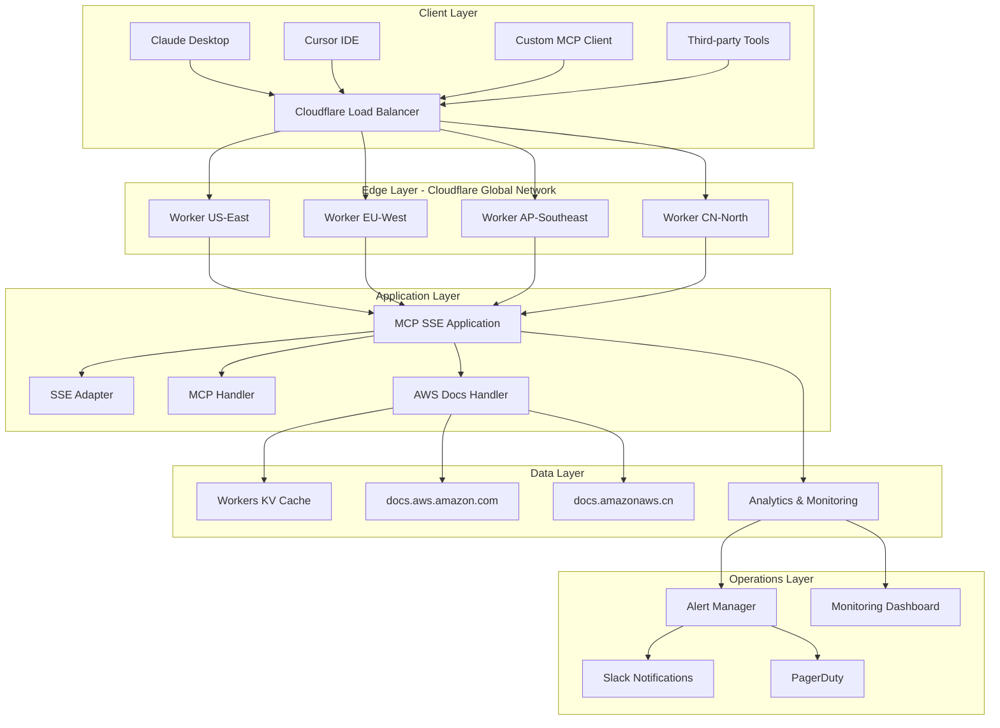
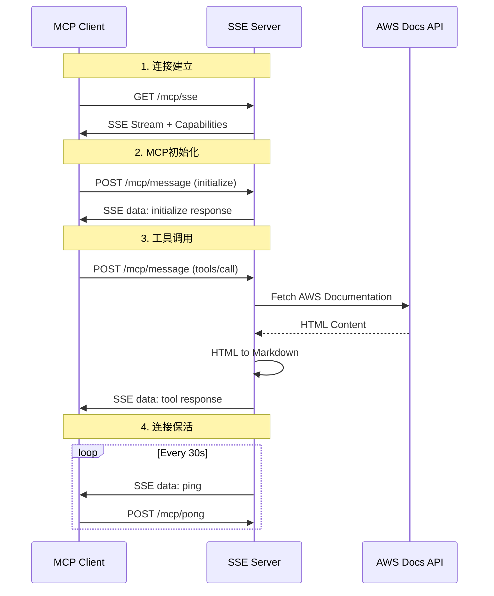
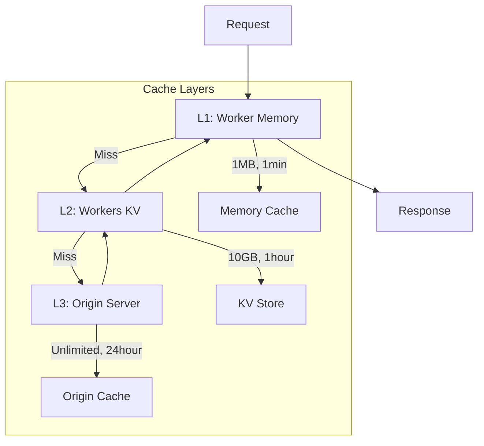

# 🏗️ AWS MCP SSE版本系统架构设计

## 🎯 架构设计目标

### 核心设计原则
- **云原生架构**: 基于Cloudflare Workers的serverless设计
- **边缘计算**: 全球分布式部署，最小化延迟
- **协议透明**: 对MCP客户端完全透明的协议转换
- **高可用性**: 多重容错和自动恢复机制
- **水平扩缩**: 支持无限水平扩展
- **安全优先**: 企业级安全防护

### 非功能需求目标
```yaml
性能目标:
  全球延迟: P95 < 100ms
  并发连接: > 10,000
  吞吐量: > 10,000 QPS
  
可用性目标:
  SLA: > 99.9%
  RTO: < 5分钟
  RPO: < 1分钟
  
安全目标:
  零信任网络: 所有连接验证
  数据加密: 传输和存储加密
  合规要求: SOC2, ISO27001
```

## 🏛️ 整体架构设计

### 系统架构图


### 分层架构详解

#### 1. 客户端层 (Client Layer)
**职责**: MCP客户端和用户接口
```typescript
支持的客户端类型:
- Claude Desktop: 主要用户群体
- Cursor IDE: 开发者工具集成
- 自定义MCP客户端: API集成
- 第三方工具: 扩展生态系统

连接协议:
- 主协议: Server-Sent Events (SSE)
- 降级协议: WebSocket, HTTP Polling
- 传输加密: TLS 1.3
```

#### 2. 边缘层 (Edge Layer) 
**职责**: 全球负载均衡和边缘缓存
```yaml
Cloudflare全球网络:
  节点数量: 300+全球数据中心
  负载均衡: 基于延迟的智能路由
  边缘缓存: 静态资源和API响应缓存
  DDoS防护: 自动攻击检测和缓解
  
区域分布:
  - US-East: 北美东部用户
  - EU-West: 欧洲用户  
  - AP-Southeast: 亚太用户
  - CN-North: 中国用户(特殊分区)
```

#### 3. 应用层 (Application Layer)
**职责**: 核心业务逻辑和协议处理
```typescript
核心组件架构:
┌─────────────────────────────────────┐
│           MCP SSE Application       │
├─────────────────────────────────────┤
│  HTTP Router    │  Middleware Stack │
├─────────────────────────────────────┤
│  SSE Adapter    │  Connection Mgmt  │
├─────────────────────────────────────┤
│  MCP Handler    │  Protocol Logic   │
├─────────────────────────────────────┤
│  AWS Handler    │  Business Logic   │
└─────────────────────────────────────┘
```

#### 4. 数据层 (Data Layer)
**职责**: 数据存储和外部服务集成
```yaml
存储组件:
  Workers KV: 分布式键值存储
    - 文档内容缓存
    - 搜索结果缓存  
    - 配置数据存储
    
外部服务:
  AWS Documentation APIs:
    - docs.aws.amazon.com (全球)
    - docs.amazonaws.cn (中国)
  
缓存策略:
  L1缓存: Worker内存 (1MB)
  L2缓存: Workers KV (10GB)
  TTL策略: 分层过期时间
```

#### 5. 运维层 (Operations Layer)
**职责**: 监控、告警和运维自动化
```yaml
监控体系:
  指标收集: Cloudflare Analytics
  日志聚合: 结构化日志存储
  性能监控: Real User Monitoring
  
告警机制:
  实时告警: 关键指标阈值
  升级策略: 分级告警处理
  通知渠道: Slack, PagerDuty, Email
```

## 🔄 协议架构设计

### MCP-to-SSE协议转换

#### 原始MCP协议 (STDIO)
```json
{
  "jsonrpc": "2.0",
  "id": 1,
  "method": "tools/call",
  "params": {
    "name": "read_documentation",
    "arguments": {"url": "https://docs.aws.amazon.com/s3/"}
  }
}
```

#### SSE协议封装
```javascript
// SSE Event Stream
data: {"type":"request","id":"req_123","timestamp":1640995200000,"data":{"jsonrpc":"2.0","id":1,"method":"tools/call","params":{"name":"read_documentation","arguments":{"url":"https://docs.aws.amazon.com/s3/"}}}}

data: {"type":"response","id":"req_123","timestamp":1640995201000,"data":{"jsonrpc":"2.0","id":1,"result":{"content":[{"type":"text","text":"Amazon S3 documentation..."}]}}}

data: {"type":"ping","id":"ping_456","timestamp":1640995230000,"data":{}}
```

### 协议转换流程


## 🔧 核心组件详细设计

### 1. SSE Adapter组件
```typescript
class MCPSSEAdapter {
  // 连接管理
  private connections: Map<string, ConnectionState> = new Map();
  private messageHandlers: Map<string, MessageHandler> = new Map();
  
  // 核心方法
  async processMessage(message: MCPMessage, connectionId: string): Promise<MCPMessage>
  generateConnectionId(): string
  registerConnection(id: string, partition: 'aws' | 'aws-cn'): void
  unregisterConnection(id: string): void
  
  // SSE流管理
  createInitMessage(connectionId: string, capabilities: ServerCapabilities): string
  createPingMessage(connectionId: string): string
  createDataMessage(connectionId: string, data: any): string
  
  // 错误处理
  createErrorResponse(id: any, code: number, message: string): MCPMessage
  createSuccessResponse(id: any, result: any): MCPMessage
}
```

**设计特点**:
- **无状态设计**: 每个Worker实例独立处理请求
- **连接池管理**: 高效的连接生命周期管理
- **协议转换**: 透明的MCP协议封装
- **错误处理**: 完整的错误代码映射

### 2. AWS文档处理器
```typescript
class AWSDocsHandler {
  private partition: 'aws' | 'aws-cn';
  private cache: DocumentCache;
  
  // 工具实现
  async handleReadDocumentation(params: ReadDocumentationParams): Promise<ToolResult>
  async handleSearchDocumentation(params: SearchDocumentationParams): Promise<ToolResult>
  async handleRecommend(params: RecommendParams): Promise<ToolResult>
  async handleGetAvailableServices(): Promise<ToolResult>
  
  // 内部方法
  private async fetchDocumentContent(url: string): Promise<string>
  private async convertHtmlToMarkdown(html: string): Promise<string>
  private async searchDocuments(query: string, limit: number): Promise<SearchResult[]>
  private async getRelatedServices(url: string): Promise<string[]>
}
```

**设计特点**:
- **分区支持**: 全球和中国分区差异化处理
- **智能缓存**: 多层缓存策略优化性能
- **内容转换**: HTML到Markdown的高效转换
- **搜索优化**: 基于相关性的搜索结果排序

### 3. 连接管理器
```typescript
interface ConnectionState {
  id: string;
  connected: boolean;
  lastPing: number;
  partition: 'aws' | 'aws-cn';
  metadata: ConnectionMetadata;
}

class ConnectionManager {
  private static readonly PING_INTERVAL = 30000; // 30秒
  private static readonly PONG_TIMEOUT = 10000;  // 10秒
  private static readonly MAX_CONNECTIONS = 10000; // 最大连接数
  
  // 连接生命周期
  registerConnection(connection: ConnectionState): void
  unregisterConnection(connectionId: string): void
  isConnectionAlive(connectionId: string): boolean
  
  // 保活机制
  startPingLoop(connectionId: string): void
  handlePong(connectionId: string): void
  cleanupStaleConnections(): void
  
  // 监控统计
  getActiveConnections(): ConnectionState[]
  getConnectionStats(): ConnectionStats
}
```

## 📦 技术栈选型

### 核心技术栈
```yaml
运行时环境:
  平台: Cloudflare Workers
  版本: Workers Runtime v2
  兼容性: Node.js 18+ APIs
  限制: 10ms CPU时间, 128MB内存
  
编程语言:
  主语言: TypeScript 5.8+
  编译目标: ES2022
  模块系统: ES Modules
  
Web框架:
  主框架: Hono.js v4.8+
  特性: 轻量级, Workers优化
  中间件: CORS, 安全头, 日志
  
协议支持:
  主协议: Server-Sent Events
  备用协议: WebSocket, HTTP Polling
  传输格式: JSON-RPC 2.0
```

### 依赖库选择
```yaml
核心依赖:
  hono: "^4.8.3"           # Web框架
  @hono/node-server: "^1.14.4"  # 本地开发
  
开发依赖:
  typescript: "^5.8.3"     # 类型安全
  @cloudflare/workers-types: "^4.20250628.0"  # Workers类型
  eslint: "^9.30.0"        # 代码检查
  prettier: "^3.6.2"       # 代码格式化
  wrangler: "^4.22.0"      # 部署工具
  
测试依赖:
  jest: "^29.7.0"          # 单元测试
  @types/jest: "^29.5.0"   # Jest类型定义
  supertest: "^6.3.3"      # HTTP测试
```

### 技术选型理由
```yaml
Cloudflare Workers选择理由:
  ✅ 全球边缘网络: 300+数据中心
  ✅ 零冷启动时间: V8隔离技术
  ✅ 自动扩缩: 无需容量规划
  ✅ 成本效益: 按请求付费
  ✅ 内置安全: DDoS防护, WAF
  
Hono.js选择理由:
  ✅ Workers优化: 专为Workers设计
  ✅ 轻量级: < 10KB bundle size
  ✅ 高性能: 基准测试领先
  ✅ TypeScript原生: 完整类型支持
  ✅ 中间件生态: 丰富的插件
  
SSE协议选择理由:
  ✅ 浏览器原生: 无需额外库
  ✅ 自动重连: 内置重连机制
  ✅ 服务器推送: 支持实时通信
  ✅ 防火墙友好: HTTP协议兼容
  ✅ 简单实现: 比WebSocket简单
```

## 🔒 安全架构设计

### 安全防护层次
```yaml
网络层安全:
  - Cloudflare DDoS防护
  - Web Application Firewall (WAF)
  - IP白名单/黑名单
  - 地理位置过滤
  
传输层安全:
  - 强制HTTPS (TLS 1.3)
  - HTTP严格传输安全 (HSTS)
  - 证书固定 (Certificate Pinning)
  
应用层安全:
  - 输入验证和清理
  - 输出编码和转义
  - SQL注入防护 (如适用)
  - XSS防护
  
数据层安全:
  - 数据加密 (静态和传输)
  - 访问控制列表 (ACL)
  - 数据脱敏和匿名化
  - 安全密钥管理
```

### 速率限制设计
```typescript
interface RateLimitConfig {
  // 基础限制
  globalLimit: 100000;     // 全局QPS限制
  perIPLimit: 1000;        // 每IP每小时限制
  burstLimit: 2000;        // 突发处理限制
  
  // 高级限制
  connectionLimit: 100;    // 每IP并发连接限制
  payloadLimit: 1048576;   // 1MB请求体限制
  
  // 动态限制
  adaptiveLimit: true;     // 基于负载的动态限制
  whitelistIPs: string[];  // IP白名单
}

class RateLimiter {
  async checkLimit(clientIP: string, endpoint: string): Promise<boolean>
  async incrementCount(clientIP: string, endpoint: string): Promise<void>
  async getRemainingQuota(clientIP: string): Promise<number>
}
```

## 📊 性能架构设计

### 缓存架构


### 缓存策略详细设计
```typescript
interface CacheConfig {
  // L1缓存 (Worker内存)
  memoryCache: {
    maxSize: 1048576;        // 1MB
    ttl: 60000;              // 1分钟
    evictionPolicy: 'LRU';   // 最近最少使用
  };
  
  // L2缓存 (Workers KV)
  kvCache: {
    maxSize: 10737418240;    // 10GB
    ttl: 3600000;            // 1小时
    regions: 'global';       // 全球复制
  };
  
  // L3缓存 (Cloudflare Edge)
  edgeCache: {
    ttl: 86400000;           // 24小时
    customRules: CacheRule[]; // 自定义规则
  };
}

class CacheManager {
  async get(key: string): Promise<any>
  async set(key: string, value: any, ttl?: number): Promise<void>
  async invalidate(pattern: string): Promise<void>
  async getStats(): Promise<CacheStats>
}
```

### 性能监控设计
```typescript
interface PerformanceMetrics {
  // 响应时间指标
  responseTime: {
    p50: number;   // 中位数
    p95: number;   // 95百分位
    p99: number;   // 99百分位
    max: number;   // 最大值
  };
  
  // 吞吐量指标
  throughput: {
    rps: number;          // 每秒请求数
    connections: number;   // 并发连接数
    bandwidth: number;     // 带宽使用
  };
  
  // 错误率指标
  errorRate: {
    total: number;        // 总错误率
    by4xx: number;        // 4xx错误率
    by5xx: number;        // 5xx错误率
    byTimeout: number;    // 超时错误率
  };
}
```

## 🌐 全球部署架构

### 区域部署策略
```yaml
主要区域:
  us-east-1:
    用户群体: 北美东部
    预期延迟: 10-30ms
    流量占比: 35%
    
  eu-west-1:
    用户群体: 欧洲
    预期延迟: 20-50ms  
    流量占比: 25%
    
  ap-southeast-1:
    用户群体: 亚太
    预期延迟: 30-80ms
    流量占比: 30%
    
  cn-north-1:
    用户群体: 中国大陆
    预期延迟: 50-150ms
    流量占比: 10%
    特殊要求: 合规和网络限制
```

### 数据一致性设计
```yaml
一致性模型:
  配置数据: 强一致性
  缓存数据: 最终一致性
  日志数据: 最终一致性
  监控数据: 最终一致性
  
同步策略:
  配置更新: 立即全球推送
  缓存失效: 15分钟内全球同步
  日志聚合: 5分钟批量同步
```

## 📋 架构评估和验证

### 架构质量属性
```yaml
可扩展性 (Scalability):
  ✅ 水平扩展: 自动无限扩展
  ✅ 垂直扩展: Worker资源自动分配
  评估: 支持10x流量增长
  
可用性 (Availability):
  ✅ 故障转移: 自动区域切换
  ✅ 健康检查: 实时状态监控
  评估: 99.9%+ SLA目标
  
性能 (Performance):
  ✅ 延迟优化: 边缘计算架构
  ✅ 缓存策略: 多层缓存设计
  评估: P95 < 100ms目标
  
安全性 (Security):
  ✅ 多层防护: 网络到应用层
  ✅ 数据保护: 加密和访问控制
  评估: 企业级安全标准
```

### 架构风险评估
```yaml
高风险:
  - Cloudflare服务依赖 (缓解: 多云备份)
  - 单点故障可能 (缓解: 分布式设计)
  
中风险:
  - Workers资源限制 (缓解: 优化和监控)
  - 网络分区影响 (缓解: 优雅降级)
  
低风险:
  - 第三方API依赖 (缓解: 缓存和降级)
  - 配置错误 (缓解: 自动化和验证)
```

---

**🏗️ 系统架构设计完成时间**: D4-D7 (4天)
**审批负责人**: 技术架构师 + CTO
**下一步**: 详细技术规格说明书制定