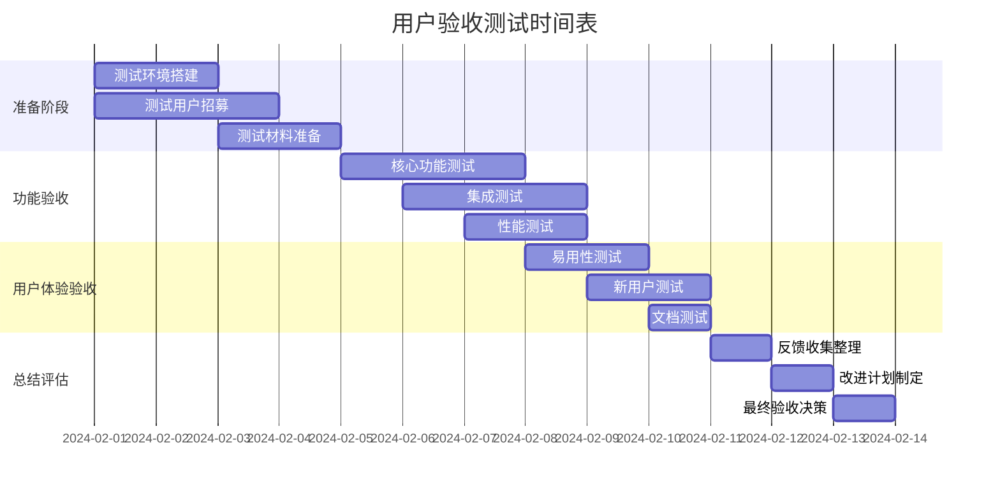

# ✅ 用户验收测试标准

## 🎯 用户验收测试目标

### 验收目标概述
确保AWS MCP SSE版本能够满足所有用户需求，提供优于STDIO版本的用户体验，并且能够无缝集成到现有工作流程中。

### 成功标准定义
- **功能完整性**: 100%兼容原有STDIO功能
- **性能提升**: 响应速度提升50%以上
- **易用性**: 90%用户能在30分钟内完成集成
- **满意度**: NPS (Net Promoter Score) ≥ 8/10
- **稳定性**: 99.9%可用性，无重大功能缺陷

## 👥 测试参与者和角色

### 测试用户分类

| 用户类型 | 人数 | 背景 | 测试重点 |
|---------|------|------|----------|
| **AI工具开发者** | 5-8人 | 有MCP集成经验 | 技术集成、API兼容性 |
| **企业用户** | 3-5人 | 在生产环境使用 | 稳定性、性能、安全性 |
| **个人开发者** | 8-12人 | 个人项目使用 | 易用性、文档完整性 |
| **新用户** | 3-5人 | 无MCP经验 | 学习曲线、入门体验 |
| **内部团队** | 5人 | 项目核心团队 | 全面功能验证 |

### 测试角色定义

#### 1. 主要验收用户 (Primary Acceptors)
**职责**: 从业务角度验证系统是否满足需求
- 验证核心业务流程
- 评估用户体验改进
- 确认性能提升效果
- 提供最终上线建议

#### 2. 技术验收用户 (Technical Acceptors)
**职责**: 从技术角度验证系统质量
- 验证API兼容性
- 测试集成便利性
- 评估系统稳定性
- 检查安全性配置

#### 3. 最终用户代表 (End User Representatives)
**职责**: 从实际使用角度提供反馈
- 模拟真实使用场景
- 测试不同客户端环境
- 提供用户体验反馈
- 验证文档和支持材料

## 📋 验收测试用例设计

### 1. 功能验收测试

#### 1.1 MCP协议兼容性测试
**测试目标**: 验证SSE版本与STDIO版本功能一致

**测试用例UAT-001**: 工具列表获取
```yaml
测试名称: "获取可用工具列表"
前置条件: 客户端已连接到SSE服务器
测试步骤:
  1. 发送 tools/list 请求
  2. 验证返回工具列表
  3. 对比STDIO版本工具列表
预期结果:
  - 返回的工具数量一致
  - 工具名称和描述一致
  - 响应时间 < 500ms
验收标准:
  - ✅ 工具列表完全匹配
  - ✅ 响应时间达标
  - ✅ 无错误发生
```

**测试用例UAT-002**: AWS文档读取
```yaml
测试名称: "读取AWS文档内容"
前置条件: 客户端已连接并初始化
测试步骤:
  1. 调用 read_documentation 工具
  2. 传入有效的AWS文档URL
  3. 验证返回的Markdown内容
  4. 对比STDIO版本结果
预期结果:
  - 返回完整的文档内容
  - Markdown格式正确
  - 内容与STDIO版本一致
验收标准:
  - ✅ 内容完整性100%
  - ✅ 格式转换正确
  - ✅ 响应时间 < 5秒
```

**测试用例UAT-003**: 文档搜索功能
```yaml
测试名称: "搜索AWS文档内容"
前置条件: 全球分区环境，客户端已连接
测试步骤:
  1. 调用 search_documentation 工具
  2. 使用常见搜索词 "S3 bucket"
  3. 验证搜索结果质量
  4. 测试不同搜索词
预期结果:
  - 返回相关搜索结果
  - 结果按相关性排序
  - 搜索响应时间合理
验收标准:
  - ✅ 搜索结果准确性 > 90%
  - ✅ 响应时间 < 3秒
  - ✅ 结果格式标准化
```

#### 1.2 连接稳定性测试
**测试用例UAT-004**: 长连接稳定性
```yaml
测试名称: "SSE长连接稳定性验证"
前置条件: 稳定网络环境
测试步骤:
  1. 建立SSE连接
  2. 保持连接30分钟
  3. 每5分钟发送一次请求
  4. 监控连接状态
预期结果:
  - 连接保持稳定
  - 所有请求正常响应
  - 无异常断线
验收标准:
  - ✅ 连接稳定性 > 99%
  - ✅ 请求成功率 > 99%
  - ✅ 无内存泄漏
```

### 2. 性能验收测试

#### 2.1 响应时间测试
**测试用例UAT-005**: 响应时间基准
```yaml
测试名称: "响应时间性能基准测试"
测试环境: 不同地理位置
测试步骤:
  1. 从美国、欧洲、亚洲发起请求
  2. 测试各种工具调用
  3. 记录响应时间分布
  4. 与STDIO版本对比
预期结果:
  - 全球平均响应时间 < 200ms
  - P95响应时间 < 500ms
  - 比STDIO版本快50%以上
验收标准:
  - ✅ 全球延迟达标
  - ✅ 性能提升明显
  - ✅ 稳定性优秀
```

#### 2.2 并发性能测试
**测试用例UAT-006**: 并发处理能力
```yaml
测试名称: "并发用户处理能力测试"
测试配置: 100个并发用户
测试步骤:
  1. 同时建立100个SSE连接
  2. 并发发送文档读取请求
  3. 监控系统资源使用
  4. 验证响应质量
预期结果:
  - 所有连接正常建立
  - 并发请求处理正常
  - 响应时间不明显恶化
验收标准:
  - ✅ 并发连接成功率 > 95%
  - ✅ 响应时间增长 < 2倍
  - ✅ 错误率 < 1%
```

### 3. 集成验收测试

#### 3.1 AI工具集成测试
**测试用例UAT-007**: Claude Desktop集成
```yaml
测试名称: "Claude Desktop MCP集成"
测试环境: macOS/Windows Claude Desktop
测试步骤:
  1. 配置MCP服务器连接
  2. 在Claude中测试AWS文档查询
  3. 验证响应展示效果
  4. 测试错误处理
预期结果:
  - 集成配置简单明了
  - 功能在Claude中正常工作
  - 错误处理用户友好
验收标准:
  - ✅ 配置时间 < 10分钟
  - ✅ 功能完全可用
  - ✅ 用户体验流畅
```

**测试用例UAT-008**: Cursor IDE集成
```yaml
测试名称: "Cursor IDE开发环境集成"
测试环境: Cursor IDE最新版本
测试步骤:
  1. 安装并配置MCP扩展
  2. 在代码开发中使用AWS文档查询
  3. 测试代码补全和文档帮助
  4. 验证工作流程集成
预期结果:
  - 扩展安装顺利
  - 开发工作流程无缝集成
  - 文档查询结果有帮助
验收标准:
  - ✅ 安装成功率 100%
  - ✅ 功能集成完整
  - ✅ 开发效率提升
```

### 4. 易用性验收测试

#### 4.1 新用户上手测试
**测试用例UAT-009**: 新用户引导体验
```yaml
测试名称: "新用户30分钟上手挑战"
测试对象: 5名无MCP经验的开发者
测试步骤:
  1. 提供README文档和示例
  2. 用户独立完成环境配置
  3. 成功运行第一个查询
  4. 记录遇到的问题和用时
预期结果:
  - 80%用户在30分钟内完成
  - 文档清晰易懂
  - 示例代码可直接运行
验收标准:
  - ✅ 成功率 ≥ 80%
  - ✅ 平均用时 ≤ 25分钟
  - ✅ 用户满意度 ≥ 8/10
```

#### 4.2 错误处理用户体验测试
**测试用例UAT-010**: 错误情况处理
```yaml
测试名称: "错误处理和恢复体验"
测试场景: 模拟各种错误情况
测试步骤:
  1. 测试网络连接中断
  2. 测试无效URL输入
  3. 测试服务器错误响应
  4. 评估错误信息和恢复建议
预期结果:
  - 错误信息清晰有用
  - 提供明确的解决建议
  - 自动恢复机制工作
验收标准:
  - ✅ 错误信息易理解
  - ✅ 恢复建议有效
  - ✅ 自动恢复成功率 > 90%
```

## 📊 验收测试执行计划

### 测试阶段安排



### 每日测试安排

#### Day 1-2: 核心功能验证
**参与者**: 技术验收用户 + 内部团队
**重点**: 基础功能完整性
```yaml
上午 (9:00-12:00):
  - UAT-001: 工具列表获取测试
  - UAT-002: AWS文档读取测试
  - UAT-003: 文档搜索功能测试

下午 (14:00-17:00):
  - UAT-004: 长连接稳定性测试
  - 功能回归测试
  - 问题记录和初步修复
```

#### Day 3-4: 性能和集成测试
**参与者**: 全部测试用户
**重点**: 性能表现和集成体验
```yaml
上午 (9:00-12:00):
  - UAT-005: 响应时间基准测试
  - UAT-006: 并发处理能力测试
  - 全球多点性能测试

下午 (14:00-17:00):
  - UAT-007: Claude Desktop集成测试
  - UAT-008: Cursor IDE集成测试
  - 其他AI工具集成验证
```

#### Day 5-6: 用户体验测试
**参与者**: 新用户 + 企业用户
**重点**: 易用性和实际应用
```yaml
上午 (9:00-12:00):
  - UAT-009: 新用户上手测试
  - 文档完整性验证
  - 示例代码测试

下午 (14:00-17:00):
  - UAT-010: 错误处理体验测试
  - 企业环境集成测试
  - 生产场景模拟
```

## 📝 验收标准和评分系统

### 验收评分矩阵

| 测试类别 | 权重 | 评分标准 | 最低通过分 |
|---------|------|----------|------------|
| **功能完整性** | 40% | 0-10分 | 8分 |
| **性能表现** | 25% | 0-10分 | 7分 |
| **易用性** | 20% | 0-10分 | 7分 |
| **稳定性** | 10% | 0-10分 | 8分 |
| **文档质量** | 5% | 0-10分 | 7分 |

### 详细评分标准

#### 功能完整性 (40%)
```yaml
10分: 所有功能完美工作，100%兼容STDIO版本
9分:  99%功能正常，1个轻微问题
8分:  95%功能正常，2-3个轻微问题
7分:  90%功能正常，存在一些问题但不影响核心使用
6分:  85%功能正常，有明显问题需要修复
≤5分: 核心功能存在严重问题，不可接受
```

#### 性能表现 (25%)
```yaml
10分: 性能超过预期，比STDIO快75%以上
9分:  性能优秀，比STDIO快50-75%
8分:  性能良好，比STDIO快25-50%
7分:  性能达标，比STDIO快0-25%
6分:  性能接近STDIO，无明显提升
≤5分: 性能不如STDIO，存在明显退化
```

#### 易用性 (20%)
```yaml
10分: 极易使用，新用户15分钟内上手
9分:  很易使用，新用户20分钟内上手
8分:  较易使用，新用户25分钟内上手
7分:  易于使用，新用户30分钟内上手
6分:  一般易用，新用户需要35分钟
≤5分: 使用困难，新用户需要45分钟以上
```

### 验收决策矩阵

| 总分范围 | 决策 | 后续行动 |
|---------|------|----------|
| **9.0-10.0** | 🎉 完全通过 | 立即上线 |
| **8.0-8.9** | ✅ 通过 | 修复轻微问题后上线 |
| **7.0-7.9** | ⚠️ 有条件通过 | 修复重要问题后重新验收 |
| **6.0-6.9** | ❌ 不通过 | 重大修复后重新验收 |
| **< 6.0** | 🛑 严重不通过 | 重新开发核心功能 |

## 📋 测试执行检查清单

### 测试前准备
- [ ] 测试环境部署完成
- [ ] 测试数据准备就绪
- [ ] 测试用户招募完成
- [ ] 测试工具和脚本准备
- [ ] 基准数据收集完成
- [ ] 测试文档分发给用户
- [ ] 反馈收集渠道建立
- [ ] 问题跟踪系统准备

### 测试执行中
- [ ] 每日测试进度跟踪
- [ ] 实时问题记录和分类
- [ ] 用户反馈及时收集
- [ ] 关键问题快速响应
- [ ] 测试数据实时分析
- [ ] 风险问题及时上报
- [ ] 测试环境稳定性监控
- [ ] 用户支持及时提供

### 测试完成后
- [ ] 所有测试用例执行完成
- [ ] 用户反馈收集整理
- [ ] 问题分类和优先级排序
- [ ] 性能数据分析报告
- [ ] 改进建议清单制定
- [ ] 验收报告编写完成
- [ ] 最终验收决策确定
- [ ] 后续行动计划制定

## 📊 用户反馈收集模板

### 结构化反馈表单

```yaml
用户基本信息:
  姓名: [填写]
  角色: [AI工具开发者/企业用户/个人开发者/新用户]
  经验: [MCP使用经验年限]
  环境: [操作系统和工具版本]

功能评价 (1-10分):
  工具列表功能: [分数] [备注]
  文档读取功能: [分数] [备注] 
  文档搜索功能: [分数] [备注]
  错误处理: [分数] [备注]
  整体功能完整性: [分数] [备注]

性能评价 (1-10分):
  响应速度: [分数] [备注]
  连接稳定性: [分数] [备注]
  并发处理: [分数] [备注]
  整体性能表现: [分数] [备注]

易用性评价 (1-10分):
  文档清晰度: [分数] [备注]
  集成便利性: [分数] [备注]
  错误信息有用性: [分数] [备注]
  学习成本: [分数] [备注]

开放式问题:
  1. 您最喜欢的改进是什么？
  2. 您认为最需要改进的地方是什么？
  3. 与STDIO版本相比，您的整体感受如何？
  4. 您是否愿意推荐给其他用户？(NPS评分)
  5. 其他建议或意见？

最终评价:
  总体满意度: [1-10分]
  推荐意愿: [1-10分] 
  是否支持上线: [是/否/有条件支持]
```

### 验收报告模板

```markdown
# AWS MCP SSE版本用户验收测试报告

## 执行摘要
- **测试期间**: [开始日期] - [结束日期]
- **参与用户**: [总数]人，包括[各类型用户分布]
- **测试用例**: 完成[X]个测试用例，通过率[X]%
- **整体评分**: [X.X]/10
- **验收决策**: [通过/不通过/有条件通过]

## 测试结果汇总
| 测试类别 | 目标分数 | 实际分数 | 通过状态 |
|---------|----------|----------|----------|
| 功能完整性 | ≥8.0 | [X.X] | [✅/❌] |
| 性能表现 | ≥7.0 | [X.X] | [✅/❌] |
| 易用性 | ≥7.0 | [X.X] | [✅/❌] |
| 稳定性 | ≥8.0 | [X.X] | [✅/❌] |
| 文档质量 | ≥7.0 | [X.X] | [✅/❌] |

## 关键发现
### 👍 主要优点
1. [优点1描述]
2. [优点2描述]
3. [优点3描述]

### ⚠️ 需要改进的问题
1. [问题1描述] - 优先级: [高/中/低]
2. [问题2描述] - 优先级: [高/中/低]
3. [问题3描述] - 优先级: [高/中/低]

### 📊 用户反馈统计
- **平均满意度**: [X.X]/10
- **NPS评分**: [X]/10
- **推荐上线用户比例**: [X]%

## 后续行动计划
### 上线前必须修复 (P0)
- [ ] [问题描述] - 负责人: [姓名] - 期限: [日期]

### 上线后优化 (P1/P2)
- [ ] [改进项目1] - 负责人: [姓名] - 期限: [日期]
- [ ] [改进项目2] - 负责人: [姓名] - 期限: [日期]

## 验收结论
[基于测试结果的最终验收决策和理由]

---
报告生成时间: [时间戳]
报告审批: [项目经理签名] [日期]
```

---

**✅ 用户验收测试标准设计完成！最后制定项目工期和资源分配计划。**